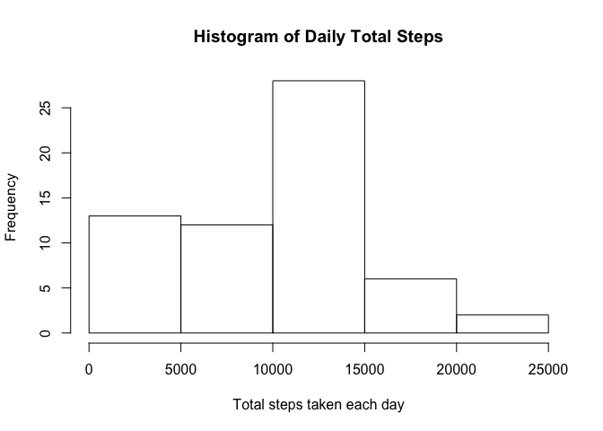
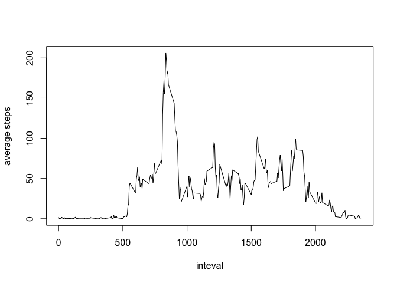
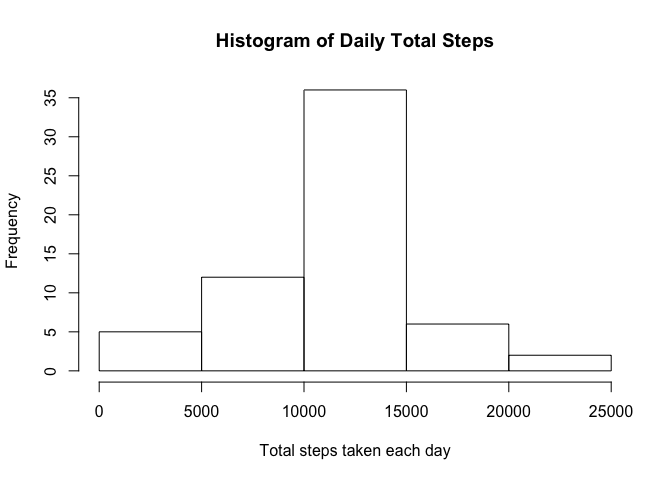
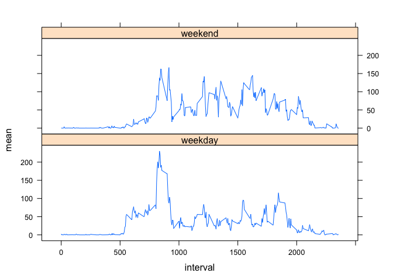

## Loading and preprocessing the data

Load the data.


```r
unzip("activity.zip")
activity <- read.csv("activity.csv")
```

Process the data.


```r
activity$date <- as.Date(activity$date, "%Y-%m-%d")
```

## What is mean total number of steps taken per day?

Calculate the total number of steps taken per day.


```r
tday <- tapply(activity$steps, activity$date, sum, na.rm=TRUE)
```

Make a histogram of the total number of steps taken each day.


```r
hist(tday, xlab="Total steps taken each day", main="Histogram of Daily Total Steps")
```

<!-- -->

Calculate and report the mean and median of the total number of steps taken per day.


```r
summary(tday)
```

```
##    Min. 1st Qu.  Median    Mean 3rd Qu.    Max. 
##       0    6778   10395    9354   12811   21194
```

The mean is 9354, the median is 10395.

## What is the average daily activity pattern?

Make a time series plot of the 5-minute interval and the average number of steps taken, averaged across all days.


```r
minterval <- tapply(activity$steps, activity$interval, mean, na.rm=TRUE)
plot(names(minterval), minterval, type="l", xlab="inteval", ylab="average steps")
```

<!-- -->

Which 5-minute interval, on average across all the days in the dataset, contains the maximum number of steps?


```r
head(sort(minterval, decreasing=TRUE))
```

```
##      835      840      850      845      830      820 
## 206.1698 195.9245 183.3962 179.5660 177.3019 171.1509
```

Interval 835 contains the maximum average steps.

## Imputing missing values

Calculate and report the total number of missing values in the dataset.


```r
sum(is.na(activity$steps))
```

```
## [1] 2304
```

Devise a strategy for filling in all of the missing values in the dataset: mean for that 5-minute interval.


```r
library(dplyr)
```

```
## 
## Attaching package: 'dplyr'
```

```
## The following objects are masked from 'package:stats':
## 
##     filter, lag
```

```
## The following objects are masked from 'package:base':
## 
##     intersect, setdiff, setequal, union
```

```r
activity <- activity %>% group_by(interval) %>%
  mutate(fillin = mean(steps, na.rm=TRUE))
```

Create a new dataset that is equal to the original dataset but with the missing data filled in.


```r
library(dplyr)
activitynew <- activity %>% mutate(steps=ifelse(is.na(steps), fillin, steps)) %>%
  select(steps, date, interval)
```

Make a histogram of the total number of steps taken each day and Calculate and report the mean and median total number of steps taken per day.


```r
tdaynew <- tapply(activitynew$steps, activitynew$date, sum, na.rm=TRUE)
hist(tdaynew, xlab="Total steps taken each day", main="Histogram of Daily Total Steps")
```

<!-- -->

```r
summary(tdaynew)
```

```
##    Min. 1st Qu.  Median    Mean 3rd Qu.    Max. 
##      41    9819   10766   10766   12811   21194
```

The mean and the median differ from the estimates from the first part. Imputing mussing data results in larger mean and larger median.

## Are there differences in activity patterns between weekdays and weekends?

Create a new factor variable indicating whether a given date is a weekday or weekend day.


```r
activitynew$weekdays <- factor(weekdays(activitynew$date), levels = c("Monday", "Tuesday", "Wednesday", "Thursday", "Friday", "Saturday", "Sunday"), labels = c(rep("weekday",times=5), rep("weekend", times=2)))
```

Make a panel plot containing a time series plot of the 5-minute interval and the average number of steps taken, averaged across all weekday days or weekend days.


```r
meannew <- activitynew %>% group_by(interval, weekdays) %>% summarise(mean=mean(steps))
library(lattice)
xyplot(mean ~ interval|weekdays, data=meannew, type="l", layout=c(1,2))
```

<!-- -->
